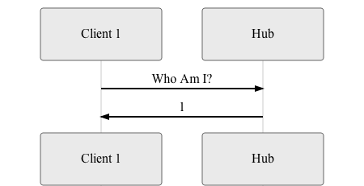
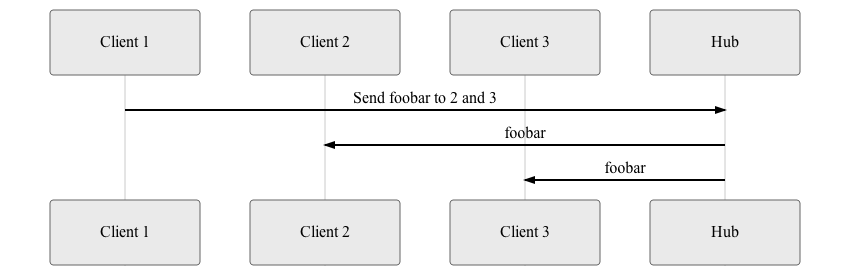

A readable, minimalist, and incomplete message delivery system in Go, including both server and client. Protocol is on top of pure TCP - no multiplexing.

### Hub

Hub relays incoming message bodies to receivers based on user ID(s) defined in the message. There's no authentication.

### Clients

Clients are users who are connected to the hub. Client may send three types of messages which are described below.

### Identity message
Clients can send a identity message which the hub will answer with the user_id of the connected user.

### List message
Clients can send a list message which the hub will answer with the list of all connected client user_id:s (excluding the requesting client).

### Relay message
Clients can send a relay messages which body is relayed to receivers marked in the message.
The data format is designed such that it consumes minimal resources.
Message body can be relayed to one or multiple receivers.

- max 255 receivers (user_id:s) per message
- message body - byte array (text, JSON, binary, or anything), max length 1024 kilobytes

*Relay example: receivers: 2 and 3, body: foobar*

## Running and building

See the Makefile, which has targets for building and testing both client and server.

## Testing

The project contains integration and benchmark tests for the hub (incl both client and server).
